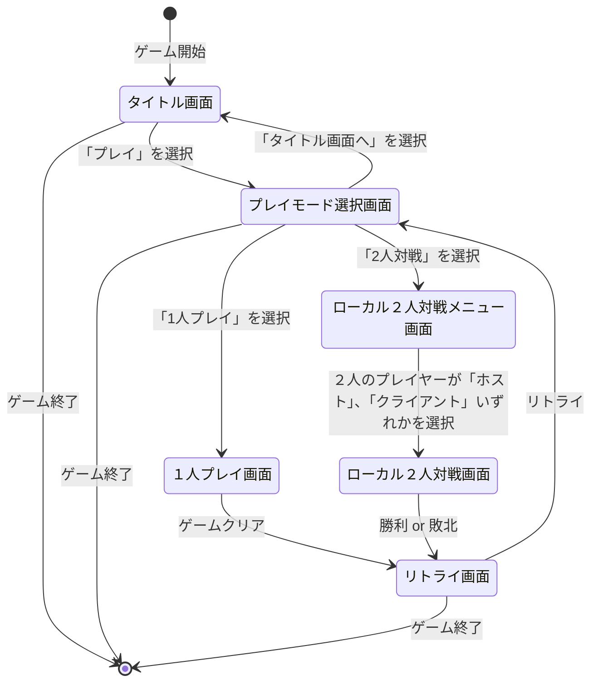

# 画面設計書(UI/UX)

## 1. 画面遷移

- UML -ステートマシン図

## 2. 画面レイアウト

### タイトルメニュー画面

- **構成要素**
  - ゲームタイトルロゴ
  - プレイボタン
    - Playボタン押下でプレイモード選択画面へ遷移
  - 終了ボタン
    - Quitボタン押下でゲーム終了

- **UXポイント**
  - シンプルなレイアウト、主要ボタンは中央に大きく配置

---

### プレイモード選択画面

- **構成要素**
  - 1人プレイボタン
    - Single Play(1P)ボタン押下で1人プレイ画面へ遷移
  - 2人対戦ボタン
    - Local Versus(2P)ボタン押下で2人プレイメニュー画面へ遷移
  - タイトルメニューボタン
    - Title Menuボタン押下でタイトルメニュー画面へ遷移
  - 終了ボタン
    - Quitボタン押下でゲーム終了

- **UXポイント**
  - シンプルなレイアウト、主要ボタンは中央に大きく配置

---

### 1人プレイ画面

- **構成要素**
  - キーボードの左右キーでパドルを移動
  - ボールがパドルの下に落ちると、一定時間経過後、画面中央からリスポーン
  - すべてのブロックを破壊するとゲーム終了
    - リトライ画面を表示

---

### リトライ画面

- **構成要素**
  - リトライボタン
    - Retryボタン押下でプレイモード選択画面へ遷移
  - 終了ボタン
    - Quitボタン押下でゲーム終了

---

### 2人プレイメニュー画面

- **構成要素**
  - ホストボタン
    - ホストとなるプレイヤーがHostボタンを押下し2人プレイ画面へ遷移
  - クライアントボタン
    - クライアントとなるプレイヤーがホストのIPアドレスを入力し、Clientボタンを押下し2人プレイ画面へ遷移
  - IPアドレス入力欄
    - クライアントがホストのIPアドレスをここに入力する

- **UXポイント**
  - リッスンサーバー方式でローカルオンライン対戦を実現する
  - Host、Clientの両ボタンが押されることでゲームが開始される

---

### 2人プレイ画面

- **構成要素**
  - キーボードの左右キーでパドルを移動
  - ボールがパドルの下に落ちると、一定時間経過後、画面中央からリスポーン
  - すべてのブロックを先に破壊した方が勝者
    - リトライ画面を表示