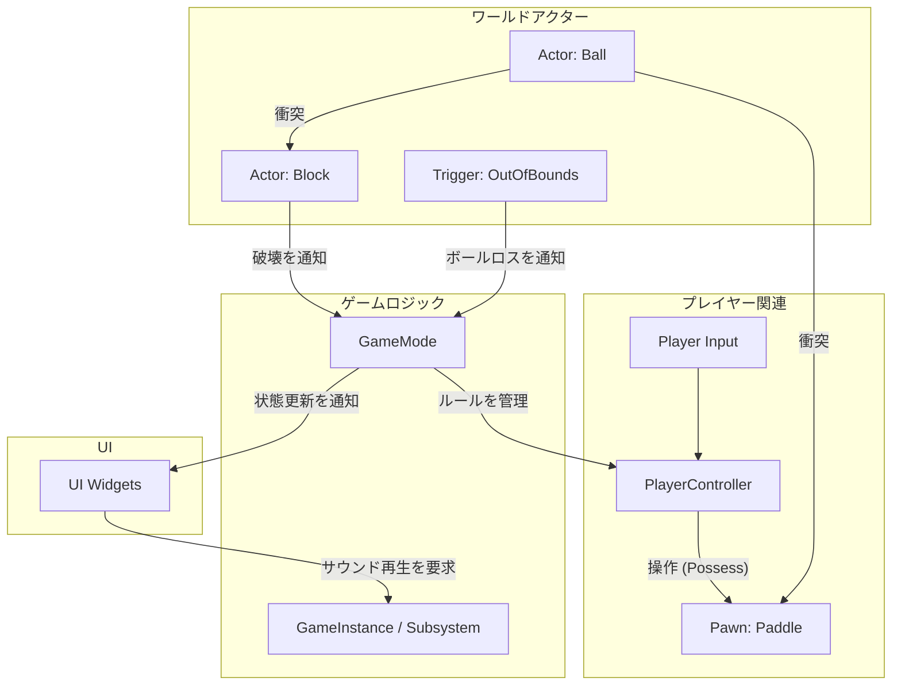

# システムアーキテクチャ設計書

- UML - コンポーネント図

```mermaid
graph TD
    subgraph "プレイヤー関連"
        A[Player Input] --> B[PlayerController];
        B -- "操作 (Possess)" --> C[Pawn: Paddle];
    end

    subgraph "ゲームロジック"
        D[GameMode]
        E[GameInstance / Subsystem];
    end

    subgraph "UI"
        F[UI Widgets];
    end

    subgraph "ワールドアクター"
        G[Actor: Ball];
        H[Actor: Block];
        I[Trigger: OutOfBounds];
    end

    %% コンポーネント間の連携 %%
    D -- "ルールを管理" --> B;
    H -- "破壊を通知" --> D;
    I -- "ボールロスを通知" --> D;
    G -- "衝突" --> C;
    G -- "衝突" --> H;
    D -- "状態更新を通知" --> F;
    F -- "サウンド再生を要求" --> E;
```