# 詳細設計書

主にUnreal Engineの設定内容を記載する

## 1. Unreal Engineフォルダ構造

- 📁 Content
  - 📁 Blueprints(Blueprintクラスのオブジェクトを配置)
    - Actor
      - Ball_BP
      - Balldestroyer_BP
      - Brick_BP
    - Widget
      - LocalMultiplayerMenu_WB
      - ModeSelect_WB
      - PlayerHud_WB
      - TitleMenu_WB
      - Win_WB
    - Pawn
      - Paddle_Client_BP
      - Paddle_Host_BP
    - PlayerController
      - PaddleController_BP
    - GameModeBase
      - Smashbrickers_gamemode
      - Smashbrickers_gamemode_1P
    - GameInstance
      - SoundGameInstance
    - BluePrintFunctionLibrary
      - UI_FunctionLibrary
  - 📁 Input
    - Input Action
      - Move_IA
    - Input Mapping Context
      - Smachbrickers_IMC
  - 📁 Maps（レベルのファイルを配置）
    - level_1P
    - level_2P
    - mode_select_menu
    - title_menu
    - twoplayer_mode_menu
  - 📁 Materials
    - Material
      - Glow_Mat
      - Master_Mat
      - Unlit_Mat
    - Material Instance Constant
      - Blueglowing_Mat
      - Green_Inst
      - Red_Inst
      - Yellow_Inst
    - Physical Material
      - Bounce_Mat
  - 📁 Sounds(ゲーム内BGM,SEの音源を配置)
    - Button_Sound_Effect_10.mp3
      - 音源取得元: [効果音ラボ](https://soundeffect-lab.info/sound/button/)
        - 決定ボタンを押す10 ゲームのスキル取得演出
      - メニューなどのボタンクリック音
    - Combat_Sound_Effect_4.mp3
      - ブロックの破壊音
    - Cursor_Move_Sound.mp3
      - ボールが壁やパドルに当たった時の音
    - Future_BGM.mp3
      - タイトルメニュー画面のBGM
    - MusMus-BGM-076.mp3
      - 音源取得元: [フリーBGM・音楽素材MusMus](https://musmus.main.jp/music_game_03.html)
        - ヒーローズ
      - ローカル２人対戦画面のBGM
    - MusMus-BGM-085.mp3
      - 音源取得元: [フリーBGM・音楽素材MusMus](https://musmus.main.jp/music_game_02.html)
        - 「思考」 DBD file No.08
      - １人プレイ画面のBGM
    - MusMus-BGM-115.mp3
      - 音源取得元: [フリーBGM・音楽素材MusMus](https://musmus.main.jp/music_game.html)
        - 隠密ファンク
      - プレイモード選択画面、ローカル２人対戦メニュー画面のBGM

## 2. 各オブジェクトの設定

### Blueprints/Actor/Ball_BP

#### EventGraph


- UML - シーケンス図
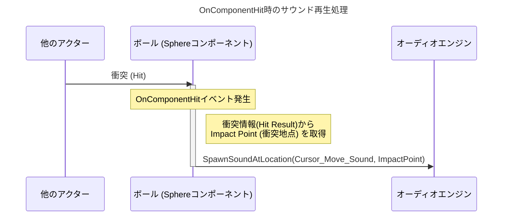

#### Components


#### Class Defauls - Details - Show Only Modified Properties

- Ball_BP(Self)
_Details.png)

- Sphere


- ProjectileMovement


---

### Blueprints/Actor/Balldestroyer_BP

#### EventGraph


- UML - アクティビティ図

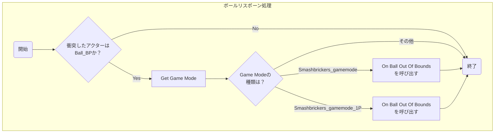

#### Components


#### Class Defauls - Details - Show Only Modified Properties

- Box


---

### Blueprints/Actor/Brick_BP

#### EventGraph


- UML - アクティビティ図

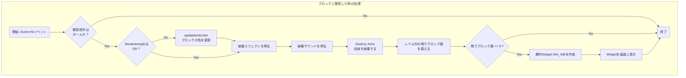
- updatebrickcolor


- UML - アクティビティ図

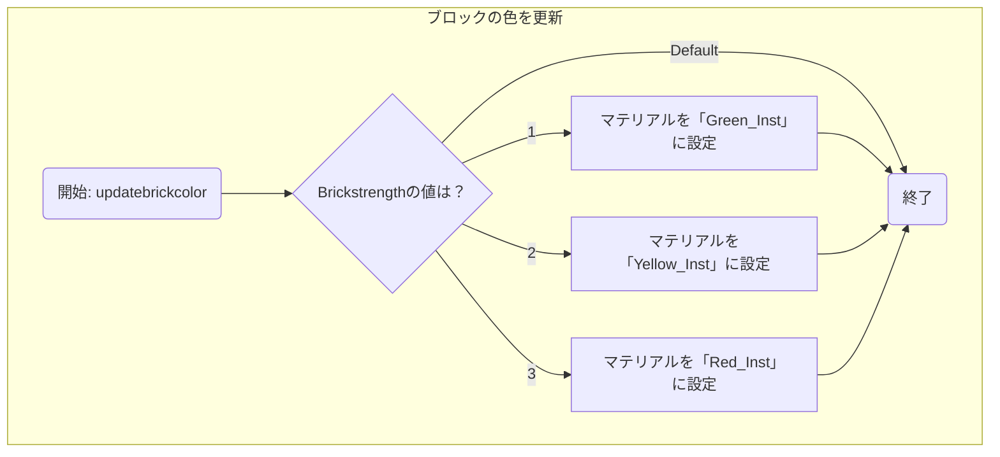

#### Components


#### Class Defauls - Details - Show Only Modified Properties

- Brick_BP(Self)

_Details.png)

- Brick_BP


---

### Blueprints/Widget/LocalMultiplayerMenu_WB

#### Designer


#### EventGraph


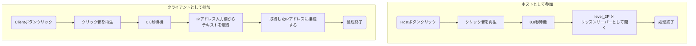


---

### Blueprints/Widget/ModeSelect_WB

#### Designer


#### EventGraph


```mermaid
graph TD
    subgraph "Widget生成時の初期化処理"
        A(Event Construct) --> B[マウスカーソルを表示];
        B --> C[インプットモードをUIのみに設定];
    end

    subgraph "1Pボタンクリック時の処理"
        D(On Clicked: oneplayerbutton) --> E[クリック音を再生];
        E --> F[0.8秒待機];
        F --> G[level_1Pを開く];
    end

    subgraph "2Pボタンクリック時の処理"
        H(On Clicked: twoplayerbutton) --> I[クリック音を再生];
        I --> J[0.8秒待機];
        J --> K[twoplayermodeを開く];
    end

    subgraph "MainMenuボタンクリック時の処理"
        L(On Clicked: mainmenubutton) --> M[クリック音を再生];
        M --> N[0.8秒待機];
        N --> O[title_menuを開く];
    end

    subgraph "Quitボタンクリック時の処理"
        P(On Clicked: quitbutton) --> Q[クリック音を再生];
        Q --> R[0.8秒待機];
        R --> S[ゲームを終了する];
    end
```

---

### Blueprints/Widget/PlayerHud_WB

#### Designer


#### EventGraph

設定なし

---

### Blueprints/Widget/TitleMenu_WB

#### Designer


#### EventGraph


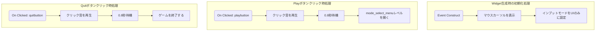

---

### Blueprints/Widget/Win_WB

#### Designer


#### EventGraph


```mermaid
graph TD
    subgraph "Widget生成時の初期化処理(Event Construct)"
        A(開始) --> B[Fadeアニメーションを再生];
        B --> C[アニメーション終了まで待機];
        C --> D[ゲームをポーズ];
        D --> E[マウスカーソルを表示];
        E --> F[インプットモードをUIのみに設定];
    end

    subgraph "Playボタンクリック時処理"
        G(On Clicked: playbutton) --> H[クリック音を再生];
        H --> I["待機 (Delay)"];
        I --> J[mode_select_menuレベルを開く];
    end

    subgraph "Quitボタンクリック時処理"
        K(On Clicked: quitbutton) --> L[クリック音を再生];
        L --> M["待機 (Delay)"];
        M --> N[ゲームを終了する];
    end
```

---

### Blueprints/Pawn/Paddle_Client_BP

#### EventGraph


- UML - アクティビティ図
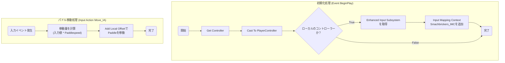

#### Components


#### Class Defauls - Details - Show Only Modified Properties


---

### Blueprints/Pawn/Paddle_Host_BP


#### EventGraph


- UML - アクティビティ図

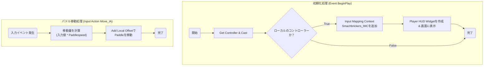

#### Components


#### Class Defauls - Details - Show Only Modified Properties


---

### Blueprints/PlayerController/PaddleController_BP

#### EventGraph


- UML - アクティビティ図

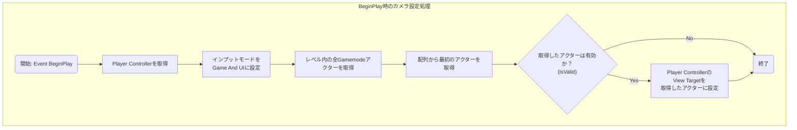

---

### Blueprints/GameModeBase/Smashbrickers_gamemode

#### EventGraph


- UML - シーケンス図

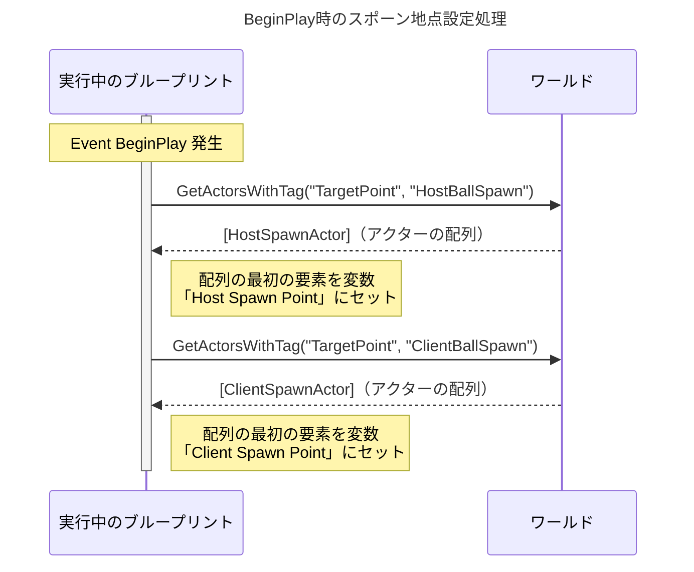


- UML - シーケンス図

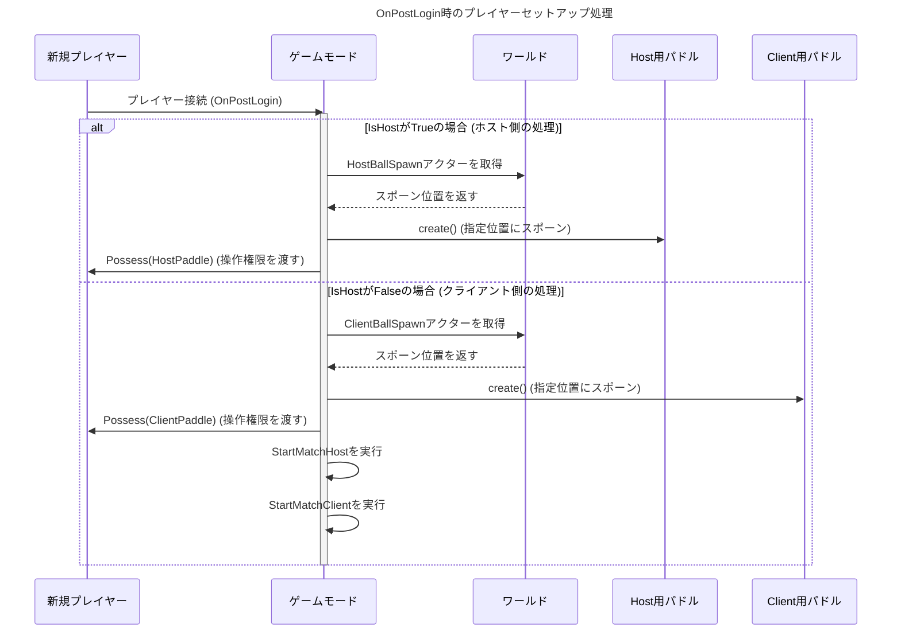


- UML - アクティビティ図

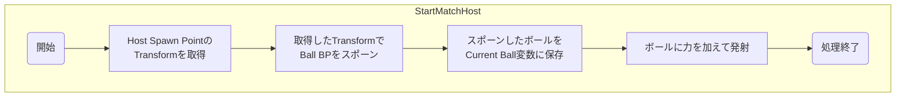

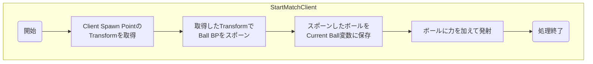

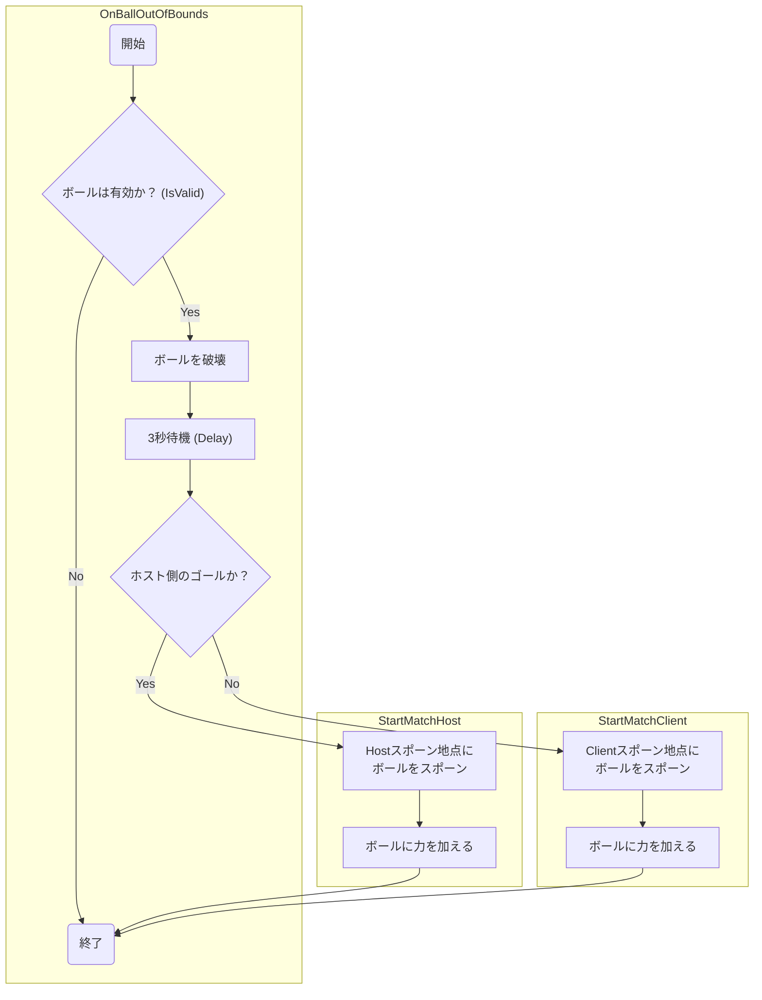

#### Components


#### Class Defauls - Details - Show Only Modified Properties

_Details.png)

---

### Blueprints/GameModeBase/Smashbrickers_gamemode_1P

#### EventGraph


- UML - シーケンス図

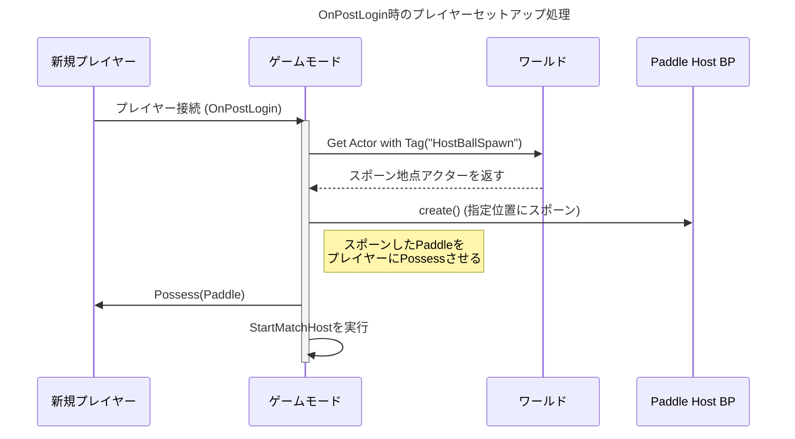


- UML - アクティビティ図


- UML - アクティビティ図

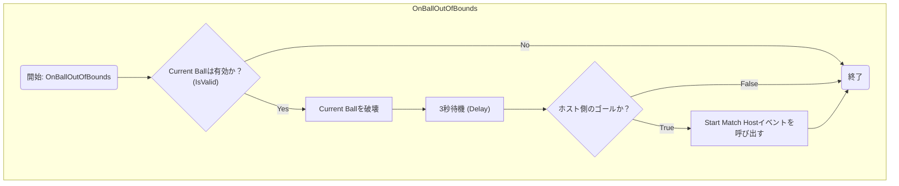

#### Components


#### Class Defauls - Details - Show Only Modified Properties

_Details.png)


---

### Blueprints/GameInstance/SoundGameInstance

#### Functions


- UML - アクティビティ図

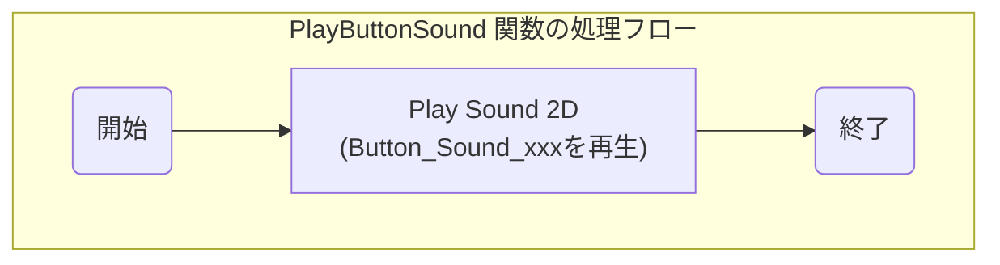

---

### Blueprints/BluePrintFunctionLibrary/UI_FunctionLibrary

#### Functions


- UML - アクティビティ図

```mermaid
graph TD
    subgraph "PlayButtonClickSound 関数の処理フロー"
        A(開始) --> B[Get Game Instance];
        B --> C{"Cast To SoundGameInstance"};
        C -- 成功 --> D["SoundGameInstanceの<br>Play Button Sound関数を呼び出す"];
        C -- 失敗 --> E(終了);
        D --> E;
    end
```

---

### Input/Input Action/Move_IA

#### Details


---

### Input/Input Mapping Context/Smachbrickers_IMC

#### Details


---

### Maps/level_1P

#### Item


#### EventGraph


- UML - アクティビティ図

```mermaid
graph TD
    subgraph "BeginPlay時のBGM再生処理"
        A(開始: Event BeginPlay) --> B["Play Sound 2D<br>(MusMus-BGM-xxxを再生)"];
        B --> C(終了);
    end
```


---

### Maps/level_2P

#### Item


#### EventGraph


- UML - アクティビティ図

```mermaid
graph TD
    subgraph "BeginPlay時のBGM再生処理"
        A(開始: Event BeginPlay) --> B["Play Sound 2D<br>(MusMus-BGM-xxxを再生)"];
        B --> C(終了);
    end
```

---

### Maps/mode_select_menu

#### EventGraph


- UML - アクティビティ図

```mermaid
graph TD
    subgraph "BeginPlay時の初期化処理"
        A(開始: Event BeginPlay) --> B[BGMを再生];
        B --> C[Mode Select Widgetを作成];
        C --> D[作成したWidgetを画面に表示];
        D --> E(処理終了);
    end
```

---

### Maps/title_menu

#### EventGraph


- UML - アクティビティ図

```mermaid
graph TD
    subgraph "BeginPlay時の初期化処理"
        A(開始: Event BeginPlay) --> B[BGMを再生];
        B --> C[Title Menu Widgetを作成];
        C --> D[作成したWidgetを画面に表示];
        D --> E(処理終了);
    end
```

---

### Maps/twoplayer_mode_menu

#### EventGraph


- UML - アクティビティ図

```mermaid
graph TD
    subgraph "BeginPlay時の初期化処理"
        A(開始: Event BeginPlay) --> B[BGMを再生];
        B --> C[Player Controllerを取得];
        C --> D{"Player Controllerは<br>有効か？ (IsValid)"};
        D -- No --> H(終了);
        D -- Yes --> E[マウスカーソルを表示];
        E --> F["Local Multiplayer Menu<br>Widgetを作成"];
        F --> G[作成したWidgetを画面に表示];
        G --> H;
    end
```

---

### Materials/Material/Glow_Mat

#### Parameters


### MaterialGraph


---

### Materials/Material/Master_Mat

#### Parameters


### MaterialGraph


---

### Materials/Material/Unlit_Mat

#### Parameters


### MaterialGraph


---

### Materials/Material Instance Constant/Blueglowing_Mat

#### Details


---

### Materials/Material Instance Constant/Green_Inst

#### Details


---

### Materials/Material Instance Constant/Red_Inst

#### Details


---

### Materials/Material Instance Constant/Yellow_Inst

#### Details


---

### Materials/Physical Material/Bounce_Mat

#### Details


